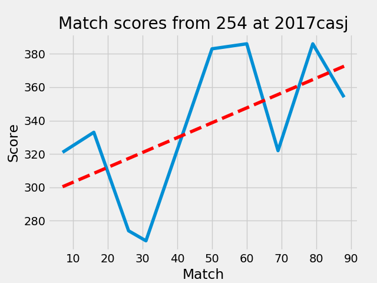

Introduction to Data Analysis
=============================

So you're at a competition, your robot's running great, and you're one of the top teams. Unfortunately, you have no clue what to do during alliance selections because you didn't do any data analysis.

Phases
------

There are several phases of data analysis:
- Requirements
- Collection
- Processing
- Modelling
- Analysis

I will be going through all of these phases in detail to show good practices for all of them, as well as giving some examples on how to execute them properly. For this tutorial, I will be using <a href="https://thebluealliance.com/apidocs">The Blue Alliance's API</a> to get data quickly, since I don't have ready access to a competition to collect data from.

Data Requirements
-----------------

The first step when starting your data analysis is deciding which pieces of information are needed. Now obviously, you're not going to need to know what color the robot is to know if they're a good robot to pick. You need to pick attributes that compliment your robot, while also being effective to the game. Some pieces of information you could want is, using 2017 as an example, the accuracy of their gear autonomous, cycle times for gear, consistency for shooting fuel, or how well the team can play defense.

Data Collection
---------------

The collection of the data is one of the most important steps for data analysis. Without having a dataset that has high quality information, it will be nearly impossible to create a good analysis. Depending on the situation, there are several different styles of data collection that could be used.

Scouting Apps
^^^^^^^^^^^^^

Using scouting apps is the most common form of electronic scouting. There are several apps that teams create and publish to Google Play and the App Store. These let your team quickly jump into scouting without devoting time to creating the app, but don't allow you to create one with only the data you need. While getting excess data is never bad, it can distract the scouters from the information that's actually needed.

Paper Scouting
^^^^^^^^^^^^^^

Many teams opt out of technology for their scouting and go with a paper and pencil method. While primitive, this works extremely well, allowing the scouters to very quickly pick up on how to fill out the scouting forms. Teams that go with paper scouting usually prepare a printed spreadsheet for every single team at a competition and store them in a box until they need to be used, then distribute them out to all the scouters for each match.

Data Processing
---------------

This is predominantly a thing that needs to be done in electronic scouting, where the data that is collected gets transformed into a more computer readable format. This will make the modelling phase go much smoother, as the data is already organized in an easy to understand format for the program to interact with.

Data Modelling
--------------

This part is, in my opinion, the most fun part of data analysis. This is the part where all the data that was collected gets put into easy to understand graphs, making it much easier to analyze and explain. It can help to show trends between matches, or even compare teams side by side. This is also one of the most important steps for the analysis, as this can make or break the scouting data. There are several different styles of graphs, all being used to represent different things.

Line Graph
^^^^^^^^^^

One of the most common styles of graph, a line graph shows the trends between data using lines that connect points together. It can very quickly allow you to compare data by match, so it can be easy to see whether a team improved over their competitions.

Scatter Plots
^^^^^^^^^^^^^

Best for printing out raw data, you can easily see the trends of where a team lies with data. Very similar to a line graph, it plots points, but doesn't draw lines connecting them together. If using python and matplotlib for the visualization, you can use numpy to calculate a trendline between all of the points and see the average between all of the points.

Using matplotlib
^^^^^^^^^^^^^^^^

One of the most popular python modules for data visualization is matplotlib. It provides very easy functions for plotting data, allowing you to use several types of graphs. I wrote up some example code that retrieves data using my python api for The Blue Alliance, and then plots match scores vs. match number to show whether a team improved throughout qualification matches. This picture shows the result of the code, while also giving a very basic example of what's possible with matplotlib.

.. code-block:: python

    '''
    NOTE: The following code requires a few modules to run.
                numpy
                matplotlib
                frctba
    '''

    import numpy as np
    import matplotlib.pyplot as plt
    from tba import tbaapi3 as tbapi

    # Sets Plot styling.
    # https://tonysyu.github.io/raw_content/matplotlib-style-gallery/gallery.html for list of styles
    plt.style.use('fivethirtyeight')

    # Get the raw json from The Blue Alliance
    teamkey, event = 'frc5203', '2017mimid'
    matches = tbapi._fetch('team/%s/event/%s/matches/simple' % (teamkey, event))
    matchdata = []

    # Collect match scores for qualification matches
    for match in matches:
    if match['comp_level'] == 'qm':
        matchnum = match['match_number']
        if teamkey in match['alliances']['blue']['team_keys']:
            score = match['alliances']['blue']['score']
        else:
            score = match['alliances']['red']['score']
        matchdata.append((matchnum, score))
    # Sort by match. Not necessary, but makes it easier to read when printing.
    matchdata.sort()
    # Create a numpy array for ease of use
    data = np.array(matchdata)

    # Create Trendline
    x, y = data[:,0], data[:,1]
    polyfit = np.polyfit(x, y, 1)
    trend = np.poly1d(polyfit)

    # Print numpy array and plot the data with a trendline.
    print(data)
    plt.plot(x,y)
    plt.plot(x, trend(x), 'r--')

    # Sets plot title and axis names.
    plt.title('Match scores from %s at %s' % (teamkey[3:], event))
    plt.xlabel('Match')
    plt.ylabel('Score')

    # Shows the plot in a window
    plt.show()

These 42 lines above show 4 phases of data analysis. Before starting to write the code, I decided that I wanted to plot the scores in relation to the match number. At the beginning of the code, the data is collected, just using some basic API calls to retrieve match data from a competition. After that, the data is processed to use only the information that is necessary for the graph. Finally, I do some modelling, plotting points using the match number as the x-axis, with the scores on the y-axis. After seeing the very sporadic results, I used numpy to find a trend line, which gives a more accurate view of how much the team has improved.
