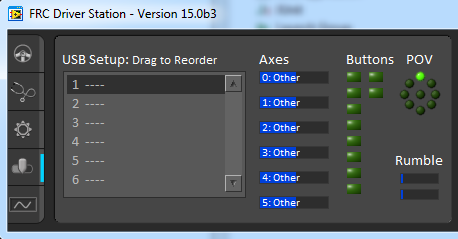

Controllers
===========

Determining Joystick Mappings
-----------------------------
One way to determine joystick mapping is by writing robot code to display axis and button values via the dashboard or console, loading it on the robot, then testing the joystick. A simpler way is to use the Driver Station. The 2015 FRC Driver Station contains indicators of the values of axes buttons and the POV that can be used to determine the mapping between physical joystick features and axis or button numbers. Simply click the joystick in the list to select it and the indicators will begin responding to the joystick input.

XBox Controller
---------------

When using an Xbox controller, it can be a pain to determine the mappings yourself. Thankfully, WPILib has already done that, and put them into a class called `XboxController <http://first.wpi.edu/FRC/roborio/release/docs/java/edu/wpi/first/wpilibj/XboxController.html>`_

Joystick Utilities
==================

Toggles
-------
If you want to be able to turn on a system with the push of a button, but not have to hold the button the entire time (but have the option to), or push a different button to turn it off, you would want a toggle. The concept of it is simple, press the button, it turns on, press it again, it turns off. The execution of it is slightly more difficult, requiring a few variables to store the current state of the toggle.

.. tabs::

    .. code-tab:: java

		public class MyRobot extends IterativeRobot{
			public void robotInit(){
				Joystick joystick = new Joystick(0);
			}

			boolean toggleOn = false;
			boolean togglePressed = false;

			public void teleopPeriodic(){
				if(joystick.getRawButton(1)){
					if(!togglePressed){
						toggleOn = !toggleOn;
						togglePressed = true;
					}
				}else{
					togglePressed = false;
				}
				if(toggleOn){
					// Do something when toggled on
				}else{
					// Do something when toggled off
				}
			}
		}

    .. code-tab:: c++

		This still needs to be done. If you'd like to do it, fork the github repository at https://github.com/FRC-PDR/ProgrammingDoneRight

    .. code-tab:: py

		'''
		NOTE: Uses robotpy_ext/control/toggle.py, which isn't
		merged with the latest version of robotpy yet (v2017.1.5)
		'''
		class MyRobot(wpilib.IterativeRobot):
			def robotInit(self):
				self.joystick = wpilib.Joystick(0)
				self.toggle = Toggle(self.joystick, 0)

			def teleopPeriodic(self):
				if self.toggle:
					# Do something when button pressed
				if self.toggle.on:
					# Do Something when toggled on
				if self.toggle.off:
					# Do Something when toggled off

Debouncers
----------
When you get a joystick button input, sometimes the mechanical switch will bounce and register one press as 2 hits. To fix this, you should use something called a **Debouncer**. This will make it so the button is only registered as pressed once, making it much easier to control your inputs. Debouncers are also useful when you want a surefire way of only sending one pulse (instead having to press and release really quickly).

.. tabs::

	.. code-tab:: java

		public class MyRobot extends IterativeRobot{
			public void robotInit(){
				Joystick joystick = new Joystick(0);
				ButtonDebouncer debouncer = new ButtonDebouncer(joystick, 1, .5);
			}

			public void teleopPeriodic(){
				if(debouncer.get()){
					System.out.print() // This print statement will only get called every .5 seconds
				}
			}
		}

		public class ButtonDebouncer(){

			Joystick joystick;
			int buttonnum;
			double latest;
			double debounce_period;

			public ButtonDebouncer(Joystick joystick, int buttonnum){
				this.joystick = joystick;
				this.buttonnum = buttonnum;
				this.latest = 0;
				this.debounce_period = .5;
			}
			public ButtonDebouncer(Joystick joystick, int buttonnum, float period){
				this.joystick = joystick;
				this.buttonnum = buttonnum;
				this.latest = 0;
				this.debounce_period = period;
			}

			public void setDebouncePeriod(float period){
				this.debounce_period = period;
			}

			public boolean get(){
				double now = Timer.getFPGATimestamp();
				if(joystick.getRawButton(buttonnum)){
					if((now-latest) > debounce_period){
						latest = now;
						return true;
					}
				}
				return false;
			}
		}

	.. code-tab:: c++

		class MyRobot(wpilib.IterativeRobot){

		public:
			ButtonDebounce debouncer (joystick, 1, .5)
			public void teleopPeriodic()
			{
				if debouncer.get(){
					cout << endl; // This print line will only get called every .5 seconds
				}
			}
		}
		class ButtonDebouncer{

			Joystick joystick;
			int buttonnum;
			double latest;
			double debounce_period;

		public:
			ButtonDebouncer(Joystick joystick, int buttonnum){
				this.joystick = joystick;
				this.buttonnum = buttonnum;
				this.latest = 0;
				this.debounce_period = .5;
			}
			ButtonDebouncer(Joystick joystick, int buttonnum, float period){
				this.joystick = joystick;
				this.buttonnum = buttonnum;
				this.latest = 0;
				this.debounce_period = period;
			}

			void setDebouncePeriod(float period){
				this.debounce_period = period;
			}

			bool get(){
				double now = Timer.getFPGATimestamp();
				if(joystick.getRawButton(buttonnum)){
					if((now-latest) > debounce_period){
						latest = now;
						return true;
					}
				}
				return false;
			}
		}

	.. code-tab:: py

		from robotpy_ext.control import ButtonDebouncer
		class MyRobot(wpilib.IterativeRobot):

			def robotInit(self):
				self.joystick1 = wpilib.Joystick(1)
				# Joystick object, Button Number, Period of time before button is pressed again
				self.button = ButtonDebouncer(self.joystick, 1, period=.5)

			def teleopPeriodic(self):
				if self.button.get():
					print() # This print statement will only get called every .5 seconds
